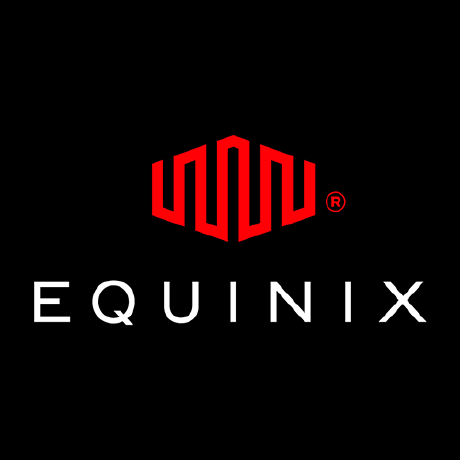

# Equinix provider for DevPod

 

## Introduction

This is a community provider for [DevPod](https://devpod.sh/). It allows you to create a DevPod
on [Equinix](https://deploy.equinix.com/).

## Getting started

The provider is available for auto-installation using

```sh
devpod provider add github.com/dirien/devpod-provider-equinix
devpod provider use github.com/dirien/devpod-provider-equinix
```

## Important notes

- The provider uses [Flatcar Container Linux](https://www.flatcar.org/) as the operating system. Hence, the underlying
  cloud-init
  configuration does not implement the installation of Docker as it is already included in the OS.
- Bare Metal server provisioning is slow. It can take several minutes until the server is ready.
